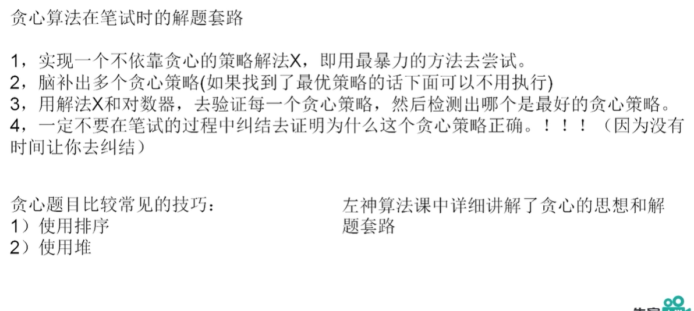

# 贪心算法

一、基本概念

贪心算法（又称贪婪算法）是指，在对问题求解时，总是做出在当前看来是最好的选择。也就是说，不从整体最优上加以考虑，他所做出的是在某种意义上的局部最优解。

贪心算法不是对所有问题都能得到整体最优解，关键是贪心策略的选择，选择的贪心策略必须具备无后效性，即某个状态以前的过程不会影响以后的状态，只与当前状态有关。

二、贪心算法的基本思路

- 建立数学模型来描述问题
- 把求解的问题分成若干个子问题
- 对每个子问题求解，得到子问题的局部最优解
- 把子问题的解局部最优解合成原来问题的一个解

三、适用场景

最大最小最优 

- 技巧：使用排序	使用堆



## [122. 买卖股票的最佳时机 II](https://leetcode-cn.com/problems/best-time-to-buy-and-sell-stock-ii/)

难度简单

给定一个数组，它的第 *i* 个元素是一支给定股票第 *i* 天的价格。

设计一个算法来计算你所能获取的最大利润。你可以尽可能地完成更多的交易（多次买卖一支股票）。

**注意：**你不能同时参与多笔交易（你必须在再次购买前出售掉之前的股票）。

**示例 1:**

```
输入: [7,1,5,3,6,4]
输出: 7
解释: 在第 2 天（股票价格 = 1）的时候买入，在第 3 天（股票价格 = 5）的时候卖出, 这笔交易所能获得利润 = 5-1 = 4 。
     随后，在第 4 天（股票价格 = 3）的时候买入，在第 5 天（股票价格 = 6）的时候卖出, 这笔交易所能获得利润 = 6-3 = 3 。
```

**示例 2:**

```
输入: [1,2,3,4,5]
输出: 4
解释: 在第 1 天（股票价格 = 1）的时候买入，在第 5 天 （股票价格 = 5）的时候卖出, 这笔交易所能获得利润 = 5-1 = 4 。
     注意你不能在第 1 天和第 2 天接连购买股票，之后再将它们卖出。
     因为这样属于同时参与了多笔交易，你必须在再次购买前出售掉之前的股票。
```

**示例 3:**

```
输入: [7,6,4,3,1]
输出: 0
解释: 在这种情况下, 没有交易完成, 所以最大利润为 0。
```

**提示：**

- `1 <= prices.length <= 3 * 10 ^ 4`
- `0 <= prices[i] <= 10 ^ 4`

#### 贪心+一次遍历

 由于不限制交易次数，只要今天股价比昨天高，就交易。计算的过程并不是真正交易的过程

```js
let maxProfit = ((prices) => {
    let profit = 0; 
    for(let i = 0; i < prices.length; i++){
        if(prices[i] < prices[i + 1]){
            profit += prices[i + 1] - prices[i];
        }
    }
    return profit;
});
```

- 时间复杂度：O(n),只需遍历一次
- 空间复杂度：O(1),需要常量的空间

```js
let maxProfit = ((prices) => {
    let profit = 0; 
    for(let i = 0; i < prices.length; i++){
        if(prices[i] < prices[i + 1]){
            profit += Math.max(0, prices[i + 1] - prices[i]);
        }
    }
    return profit;
});
```

- 时间复杂度：O(n)，其中 n为数组的长度。我们只需要遍历一次数组即可。
- 空间复杂度：O(1)，只需要常数空间存放若干变量。

## [392. 判断子序列](https://leetcode-cn.com/problems/is-subsequence/)

难度简单

给定字符串 **s** 和 **t** ，判断 **s** 是否为 **t** 的子序列。

你可以认为 **s** 和 **t** 中仅包含英文小写字母。字符串 **t** 可能会很长（长度 ~= 500,000），而 **s** 是个短字符串（长度 <=100）。

字符串的一个子序列是原始字符串删除一些（也可以不删除）字符而不改变剩余字符相对位置形成的新字符串。（例如，`"ace"`是`"abcde"`的一个子序列，而`"aec"`不是）。

**示例 1:**
**s** = `"abc"`, **t** = `"ahbgdc"`

返回 `true`.

**示例 2:**
**s** = `"axc"`, **t** = `"ahbgdc"`

返回 `false`

#### 双指针+贪心算法

当我们从前往后匹配，可以发现每次贪心地匹配靠前的字符是最优决策。

- 初始化两个指针i 和 j，分别指向 s 和t的初始位置。
- 每次贪心地匹配，匹配成功则 i和 j同时右移，匹配 s 的下一个位置，匹配失败则 j 右移，i 不变，尝试用 t 的下一个字符匹配 s。
- 最终如果 i移动到 s 的末尾，就说明 s 是 t的子序列。

```js
let isSubsequence = ((s, t) => {
    let n = s.length, m = t.length;
    let i = 0, j = 0;
    while(i < n && j < m){
        if(s[i] == t[j]){
            i++;
        }
        j++;
    }
    return i == n;
});
```

- 时间复杂度：O(n+m)，其中 n 为 s 的长度，m 为 t 的长度。每次无论是匹配成功还是失败，都有至少一个指针发生右移，两指针能够位移的总距离为 n+m。
- 空间复杂度：O(1)

## [134. 加油站](https://leetcode-cn.com/problems/gas-station/)

难度中等

在一条环路上有 *N* 个加油站，其中第 *i* 个加油站有汽油 `gas[i]` 升。

你有一辆油箱容量无限的的汽车，从第 *i* 个加油站开往第 *i+1* 个加油站需要消耗汽油 `cost[i]` 升。你从其中的一个加油站出发，开始时油箱为空。

如果你可以绕环路行驶一周，则返回出发时加油站的编号，否则返回 -1。

**说明:** 

- 如果题目有解，该答案即为唯一答案。
- 输入数组均为非空数组，且长度相同。
- 输入数组中的元素均为非负数。

**示例 1:**

```
输入: 
gas  = [1,2,3,4,5]
cost = [3,4,5,1,2]

输出: 3

解释:
从 3 号加油站(索引为 3 处)出发，可获得 4 升汽油。此时油箱有 = 0 + 4 = 4 升汽油
开往 4 号加油站，此时油箱有 4 - 1 + 5 = 8 升汽油
开往 0 号加油站，此时油箱有 8 - 2 + 1 = 7 升汽油
开往 1 号加油站，此时油箱有 7 - 3 + 2 = 6 升汽油
开往 2 号加油站，此时油箱有 6 - 4 + 3 = 5 升汽油
开往 3 号加油站，你需要消耗 5 升汽油，正好足够你返回到 3 号加油站。
因此，3 可为起始索引。
```

**示例 2:**

```
输入: 
gas  = [2,3,4]
cost = [3,4,3]
输出: -1
解释:
你不能从 0 号或 1 号加油站出发，因为没有足够的汽油可以让你行驶到下一个加油站。
我们从 2 号加油站出发，可以获得 4 升汽油。 此时油箱有 = 0 + 4 = 4 升汽油
开往 0 号加油站，此时油箱有 4 - 3 + 2 = 3 升汽油
开往 1 号加油站，此时油箱有 3 - 3 + 3 = 3 升汽油
你无法返回 2 号加油站，因为返程需要消耗 4 升汽油，但是你的油箱只有 3 升汽油。
因此，无论怎样，你都不可能绕环路行驶一周。
```

#### 贪心算法+一次遍历

- 首先检查第 0个加油站，并试图判断能否环绕一周；如果不能，就从第一个无法到达的加油站开始继续检查。

```js
var canCompleteCircuit = function(gas, cost) {
    let i = 0;
    const n = gas.length;
    while(i < n){
        // 初始化所获得的汽油及消耗汽油均为0
        let gasTotal = 0, costTotal = 0;
        // 开始检查是否走完一圈
        let count = 0;
        while(count < n){
            // 因为道路是环形的，注意索引
            const j = (i + count) % n;
            // 统计可获得汽油量及消耗量总和，进行比较
            gasTotal += gas[j]
            costTotal += cost[j]
           // 获得汽油量小于消耗量时，表示汽油无法支撑到下一个加油站
            if(costTotal > gasTotal){
                break;
            }
            // 若油量支持驶向下个站，则继续检查
            count++;
        }
        // 如果 count 等于 n，表示走完所有的加油站，
        // 那么返回起始加油站编号 i
        if(count === n){
            return i;
        // 否则起始点重置为最后能到达的加油站的下一个加油站，
        // 其中 i + count 表示能到达的最后一个加油站
        }else{
            i = i + count + 1;
        }
    }
    // 若均无法走完一圈，返回 -1
    return -1;
};
```

- 时间复杂度：O(N)，其中 N为数组的长度。对数组进行了单次遍历。
- 空间复杂度：O(1)。

## [45. 跳跃游戏 II](https://leetcode-cn.com/problems/jump-game-ii/)

难度困难

给定一个非负整数数组，你最初位于数组的第一个位置。

数组中的每个元素代表你在该位置可以跳跃的最大长度。

你的目标是使用最少的跳跃次数到达数组的最后一个位置。

**示例:**

```
输入: [2,3,1,1,4]
输出: 2
解释: 跳到最后一个位置的最小跳跃数是 2。
     从下标为 0 跳到下标为 1 的位置，跳 1 步，然后跳 3 步到达数组的最后一个位置。
```

#### 贪心 正向查找可到达的最大位置

「贪心」地进行正向查找，每次找到可到达的最远位置，就可以在线性时间内得到最少的跳跃次数。

- 维护当前能够到达的最大下标位置maxPosition，记为边界。我们从左到右遍历数组求得下一步的最远位置，到达边界时，更新边界end并将跳跃次数steps增加 1。
- 在遍历数组时，我们不访问最后一个元素，这是因为在访问最后一个元素之前，我们的边界一定大于等于最后一个位置，否则就无法跳到最后一个位置了。如果访问最后一个元素，在边界正好为最后一个位置的情况下，我们会增加一次「不必要的跳跃次数」，因此我们不必访问最后一个元素。


```js
var jump = function(nums) {
    const length = nums.length;
    let end = 0, maxPosition = 0, steps = 0;
    for(let i = 0; i < length - 1; i++){
        // 求得下一步的最远位置。
        maxPosition = Math.max(maxPosition, i + nums[i]);
        if(i == end) {// 到达边界
            // 更新边界并将跳跃次数增加 1
            end = maxPosition;
            steps++;
        }
    }
    return steps;
};
```

- 时间复杂度：O(n)，其中 n 是数组长度。
- 空间复杂度：O(1)。

## [135. 分发糖果](https://leetcode-cn.com/problems/candy/)

难度困难

老师想给孩子们分发糖果，有 *N* 个孩子站成了一条直线，老师会根据每个孩子的表现，预先给他们评分。

你需要按照以下要求，帮助老师给这些孩子分发糖果：

- 每个孩子至少分配到 1 个糖果。
- 相邻的孩子中，评分高的孩子必须获得更多的糖果。

那么这样下来，老师至少需要准备多少颗糖果呢？

**示例 1:**

```
输入: [1,0,2]
输出: 5
解释: 你可以分别给这三个孩子分发 2、1、2 颗糖果。
```

**示例 2:**

```
输入: [1,2,2]
输出: 4
解释: 你可以分别给这三个孩子分发 1、2、1 颗糖果。
     第三个孩子只得到 1 颗糖果，这已满足上述两个条件。
```

#### 两个数组

根据题意，对于每个孩子，我们只需要考虑他左右两侧的孩子。
因为要准备 尽量少 的糖果，所以，我们只在当前孩子比左右孩子分数高的时候，才给他更多糖果。
分两次遍历数组，从左到右，从右到左扫描两次数组。第一次只考虑每个孩子左边的孩子，第二次只考虑每个孩子右边的孩子(左右顺序不重要，也可以先考虑右边再考虑左边)。

```js
var candy = function (ratings) {
    if (!ratings || !ratings.length) return 0;

    // 每个孩子都有至少一颗糖果
    const candies = Array(ratings.length).fill(1);

    // 先考虑每个孩子左边的孩子，如果他比左边的分数高，就把他的糖果改成左边孩子糖果+1
    for (let i = 1; i < ratings.length; i++) {
        // 因为初始糖果数都是 1，所以 candies[i] <= candies[i - 1] 这个判断条件就没必要啦
        if (ratings[i] > ratings[i - 1]) candies[i] = candies[i - 1] + 1;
    }

    // 再考虑每个孩子右边的孩子，如果他比右边的分数高，而且他的糖果比右边的少，
    // 就将他的糖果数在右边孩子糖果的基础上加一
    for (let i = ratings.length - 2; i >= 0; i--) {
        if (ratings[i] > ratings[i + 1] && candies[i] <= candies[i + 1])
            candies[i] = candies[i + 1] + 1;
    }

    // 求和
    return candies.reduce((a, b) => a + b, 0);
};
```

时间复杂度：O(n)。 两个数组各更新一次。

空间复杂度：O(n)。 两个数组大小都为 n

## [406. 根据身高重建队列](https://leetcode-cn.com/problems/queue-reconstruction-by-height/)

难度中等

假设有打乱顺序的一群人站成一个队列，数组 `people` 表示队列中一些人的属性（不一定按顺序）。每个 `people[i] = [hi, ki]` 表示第 `i` 个人的身高为 `hi` ，前面 **正好** 有 `ki` 个身高大于或等于 `hi` 的人。

请你重新构造并返回输入数组 `people` 所表示的队列。返回的队列应该格式化为数组 `queue` ，其中 `queue[j] = [hj, kj]` 是队列中第 `j` 个人的属性（`queue[0]` 是排在队列前面的人）。

**示例 1：**

```
输入：people = [[7,0],[4,4],[7,1],[5,0],[6,1],[5,2]]
输出：[[5,0],[7,0],[5,2],[6,1],[4,4],[7,1]]
解释：
编号为 0 的人身高为 5 ，没有身高更高或者相同的人排在他前面。
编号为 1 的人身高为 7 ，没有身高更高或者相同的人排在他前面。
编号为 2 的人身高为 5 ，有 2 个身高更高或者相同的人排在他前面，即编号为 0 和 1 的人。
编号为 3 的人身高为 6 ，有 1 个身高更高或者相同的人排在他前面，即编号为 1 的人。
编号为 4 的人身高为 4 ，有 4 个身高更高或者相同的人排在他前面，即编号为 0、1、2、3 的人。
编号为 5 的人身高为 7 ，有 1 个身高更高或者相同的人排在他前面，即编号为 1 的人。
因此 [[5,0],[7,0],[5,2],[6,1],[4,4],[7,1]] 是重新构造后的队列。
```

**示例 2：**

```
输入：people = [[6,0],[5,0],[4,0],[3,2],[2,2],[1,4]]
输出：[[4,0],[5,0],[2,2],[3,2],[1,4],[6,0]]
```

#### 从高到低考虑

- 按照 hi 为第一关键字降序，ki为第二关键字升序进行排序。

```js
var reconstructQueue = function(people) {
    let res=[];
    if(!people) return [];

    // 采用从高到低排序的方法,先将people按照以下方式排序
    // 按照每项第一个数字从高到低排序，如果高度相等按照第二个数字从低到高排序
    people.sort((a,b)=>{
        if(a[0]===b[0]){
            return a[1]-b[1]
        }else{
            return b[0]-a[0]
        }
    })

    // 这里主要是通过每项的第二个数字来实现插入，保证顺序的合理性
    people.forEach(item=>{
        res.splice(item[1],0,item)
    })
    return res;
};
```

- 时间复杂度：O(n^2)，其中 n是数组people 的长度。我们需要O(nlogn) 的时间进行排序，随后需要 O(n^2) 的时间遍历每一个人并将他们放入队列中。由于前者在渐近意义下小于后者，因此总时间复杂度为 O(n^2)
- 空间复杂度：O(log n)

## [330. 按要求补齐数组](https://leetcode-cn.com/problems/patching-array/)

难度困难

给定一个已排序的正整数数组 *nums，*和一个正整数 *n 。*从 `[1, n]` 区间内选取任意个数字补充到 *nums* 中，使得 `[1, n]` 区间内的任何数字都可以用 *nums* 中某几个数字的和来表示。请输出满足上述要求的最少需要补充的数字个数。

**示例 1:**

```
输入: nums = [1,3], n = 6
输出: 1 
解释:
根据 nums 里现有的组合 [1], [3], [1,3]，可以得出 1, 3, 4。
现在如果我们将 2 添加到 nums 中， 组合变为: [1], [2], [3], [1,3], [2,3], [1,2,3]。
其和可以表示数字 1, 2, 3, 4, 5, 6，能够覆盖 [1, 6] 区间里所有的数。
所以我们最少需要添加一个数字。
```

**示例 2:**

```
输入: nums = [1,5,10], n = 20
输出: 2
解释: 我们需要添加 [2, 4]。
```

**示例 3:**

```
输入: nums = [1,2,2], n = 5
输出: 0
```

#### 贪心

[官方题解](https://leetcode-cn.com/problems/patching-array/solution/an-yao-qiu-bu-qi-shu-zu-by-leetcode/)

假设 miss 是缺少的数字中最小的，则区间 [1, miss) (左闭右开) 已经被完全覆盖。为了覆盖 miss，我们需要添加某些小于等于 miss 的数字。否则将不可能覆盖到。

例如，数组 nums = [1,2,3,8]， n = 16。已经覆盖到的数字有区间 [1, 6] 和 [8, 14]。换而言之，7, 15, 16 没有覆盖到。如果你加的数字大于 7，则 7 依然覆盖不到。

假设我们添加的数字是 xx，则区间 [1, miss) 和 [x, x + miss) 均被覆盖到。由于我们知道 x <= miss，这两个区间必然覆盖了区间 [1, x + miss)。我们希望能够尽可能选择大的 xx，这样覆盖的范围就可以尽可能大。因此，最好的选择是 x = miss。

在覆盖到 miss 后，我们可以重新计算覆盖范围，查看新的最小的缺少数字。然后加上该数字。重复操作直到全部数字都被堵盖到。

下面是这个贪心算法的流程：

- 初始化区间 [1, miss) = [1, 1) = 空
  每当 n 没有被覆盖
  若当前元素 nums[i] 小于等于 miss
  - 将范围扩展到 [1, miss + nums[i])
  - 将 i 增加 1
- 否则
  - 将 miss 添加到数组，将范围扩展到 [1, miss + miss)
  - 增加数字的计数
- 返回增加数字的数目

```js
var minPatches = function(nums, n) {
    let patches = 0, i = 0;
    let miss = 1;
    while(miss <= n){
        if(i < nums.length && nums[i] <= miss){
            miss += nums[i++];
        }else{
            miss += miss;
            patches++;
        }
    }
    return patches;
};
```

- 时间复杂度 : O(m+logn)。在每次迭代中，我们或者增加 i ，或者将 miss 加倍。 i增加的总数为 m， miss 加倍的总数为 logn。
- 空间复杂度 : O(1)。 只需要三个变量：patches，i 和 miss。

## [621. 任务调度器](https://leetcode-cn.com/problems/task-scheduler/)

难度中等

给你一个用字符数组 `tasks` 表示的 CPU 需要执行的任务列表。其中每个字母表示一种不同种类的任务。任务可以以任意顺序执行，并且每个任务都可以在 1 个单位时间内执行完。在任何一个单位时间，CPU 可以完成一个任务，或者处于待命状态。

然而，两个 **相同种类** 的任务之间必须有长度为整数 `n` 的冷却时间，因此至少有连续 `n` 个单位时间内 CPU 在执行不同的任务，或者在待命状态。

你需要计算完成所有任务所需要的 **最短时间** 。

**示例 1：**

```
输入：tasks = ["A","A","A","B","B","B"], n = 2
输出：8
解释：A -> B -> (待命) -> A -> B -> (待命) -> A -> B
     在本示例中，两个相同类型任务之间必须间隔长度为 n = 2 的冷却时间，而执行一个任务只需要一个单位时间，所以中间出现了（待命）状态。 
```

**示例 2：**

```
输入：tasks = ["A","A","A","B","B","B"], n = 0
输出：6
解释：在这种情况下，任何大小为 6 的排列都可以满足要求，因为 n = 0
["A","A","A","B","B","B"]
["A","B","A","B","A","B"]
["B","B","B","A","A","A"]
...
诸如此类
```

**示例 3：**

```
输入：tasks = ["A","A","A","A","A","A","B","C","D","E","F","G"], n = 2
输出：16
解释：一种可能的解决方案是：
     A -> B -> C -> A -> D -> E -> A -> F -> G -> A -> (待命) -> (待命) -> A -> (待命) -> (待命) -> A
```